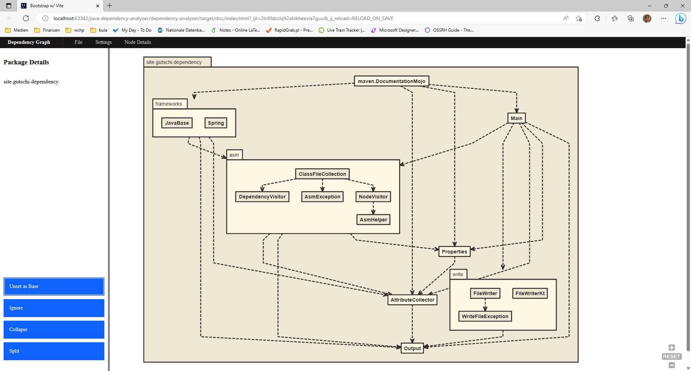

# Dependency-Analyzer


A class level dependency analyzer for JVM programs. It can be integrated as a maven plugin or run via command line, and it will generate an interactive HTML documentation of the class dependencies.


Example dependency analysis for this plugin


## Usage (Command Line)
The dependency-analyzer can be used via command line to analyze ```class``` or ```jar``` files directly. It can be started using
```shell

java -jar dependency-analyzer-0.4.1-SNAPSHOT-jar-with-dependencies.jar [arguments] inputs
```

### Configuration

The following configuration options can be used.

| Parameter              | Description                                                                                                    | Example                      | Default       |
|------------------------|----------------------------------------------------------------------------------------------------------------|------------------------------|---------------|
| --debug / -d           | Turn on debug mode (Boolean)                                                                                   | true                         | false         |
| --outputFolder / -o    | Output folder name (String)                                                                                    | /home/user/test.jar          | "Working Dir" |
| --includeFatJarClasses | When input is a SpringBoot FatJar, include the SpringBoot-Loader-Classes as well (Boolean)                     | true                         | false         |
| --fatJarMatchers | When input is a SpringBoot FatJar, include all dependencies that matches on of those regexes (List of Strings) | maven-dependency-analyzer-.* | ""         |


## Usage (Maven-Plugin)
The dependency-analyzer offers a goal "create-documentation' that will analyze the generated output in the phase ``process-classes```. It can be integrated into the build process using

```xml
<build>
    <plugins>
        <plugin>
            <groupId>site.gutschi</groupId>
            <artifactId>dependency-analyzer</artifactId>
            <version>0.4.0</version>
            <executions>
                <execution>
                    <goals>
                        <goal>create-documentation</goal>
                    </goals>
                    <configuration>
                        <!-- see below for config options-->
                    </configuration>
                </execution>
            </executions>
        </plugin>
    </plugins>
</build>
```

This will generate a documentation under `target/doc`

### Configuration

The following configuration options can be used. 

| Parameter            | Description                                                                                                                                                                                        | Example                                              | Default                          |
|----------------------|----------------------------------------------------------------------------------------------------------------------------------------------------------------------------------------------------|------------------------------------------------------|----------------------------------|
| inputs               | Input files to be considered. A list of folders or files, all ".class" and ".jar" files in this and all its sub-folders will be analyzed                                                           | target/classes,target/project.jar                    | ${project.build.outputDirectory} |
| dependencyMatchers   | Matched dependency will be analyzed as well. A list of regexes matching the string "groupId:artifactId:versionId" of the dependency. If none given, no dependencies will be analyzed               | org.apache.maven.shared:maven-dependency-analyzer:.* | -                                |
| outputFolder         | The output-folder to write the documentation to                                                                                                                                                    | target/dependency                                    | ${project.build.directory}/doc            |
| basePackage          | A preselected base-package within the generate documentation. If given, the documentation will zoom directly on this package                                                                       | com.you.application                                  | -                                |
| collapsePackages     | A list of packages who will be collapsed in the generated documentation. The plugin will try to automatically collapse external libraries, but you can overwrite this setting here.                | org.springframework,com.google                       | -                                |
| ignoredPackages      | A list of packages who will be ignored in the generated documentation. The plugin will try to automatically ignore JDK-classes, but you can overwrite this setting here.                           | java,kotlin,sun                                      | -                                |
| splitPackages        | A list of packages who will be split in the generated documentation. The plugin will try to automatically split certain widely used prefixes (e.g "org"), but you can overwrite this setting here. | org,org.apache,com                                   | -                                |

List can either be given as comma-seperated lists or using multiple arguments

```xml
<configuration>
    <inputs>
        <input>target/classes</input>
        <input>../otherLib/target/classes</input>
    </inputs>
</configuration>
```

```xml
<configuration>
    <inputs>target/classes, ../otherLib/target/classes</inputs>
</configuration>
```

## Build
In order to build this plugin from scratch, you have to install
* [Node.js](https://nodejs.org/en), Version >= 18.0.0
* [Yarn](https://yarnpkg.com/), Version >= 3.5.0
* A JDK Version >= 11

You must then build the frontend first using
```bash
cd frontend
yarn install
yarn build
```

and then build the backend using the maven wrapper
```bash
cd dependency-analyzer
./mvnw install
```

## Build With
The Frontend is build using [Typescript](https://www.typescriptlang.org/), [lit](https://lit.dev/), [Yarn](https://yarnpkg.com/) and WebComponents from the [Carbon Design System](https://web-components.carbondesignsystem.com/)

The Backend is build using [Kotlin](https://kotlinlang.org/) and [Maven](https://maven.apache.org/). The dependency analyses is performed using [ASM](https://asm.ow2.io/) and some visitors from the [maven-dependency-plugin](https://maven.apache.org/plugins/maven-dependency-plugin/). 

## Bugs
If you find any bugs or have potential improvements, please open an issue in the [GitHub-Project](https://github.com/lizzyTheLizard/java-dependency-analyzer/issues)

## Contributing
Pull requests are welcome. For major changes, please open an issue first  to discuss what you would like to change.
Please make sure to update tests as appropriate.

## License
[MIT](https://choosealicense.com/licenses/mit/)
